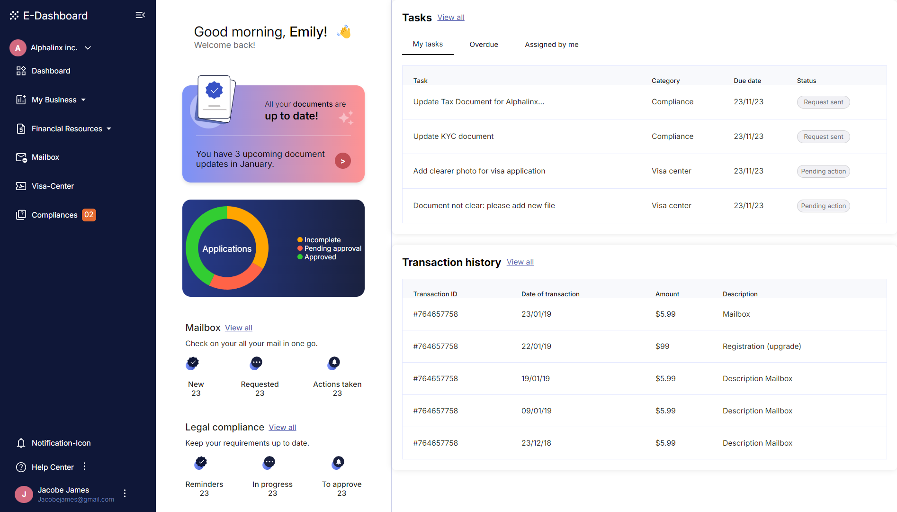
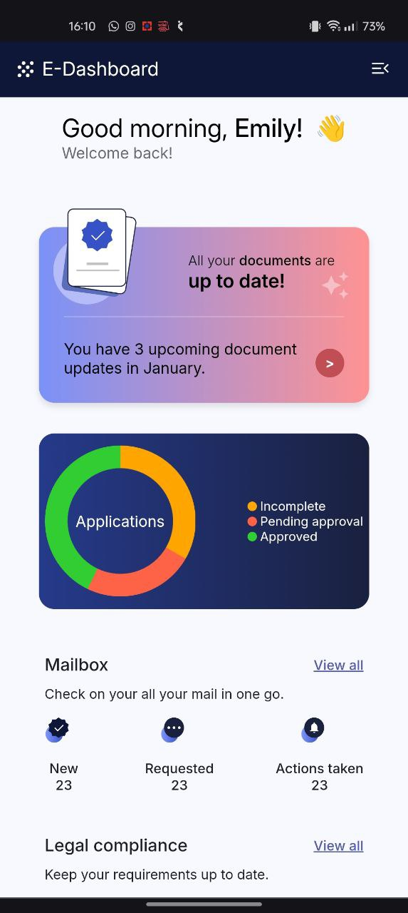
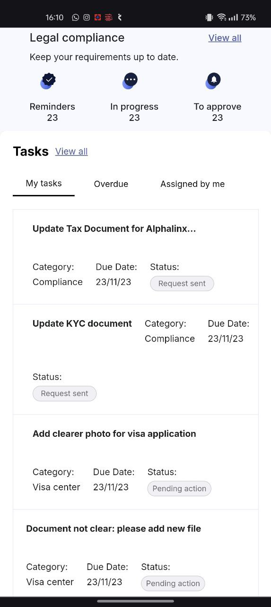
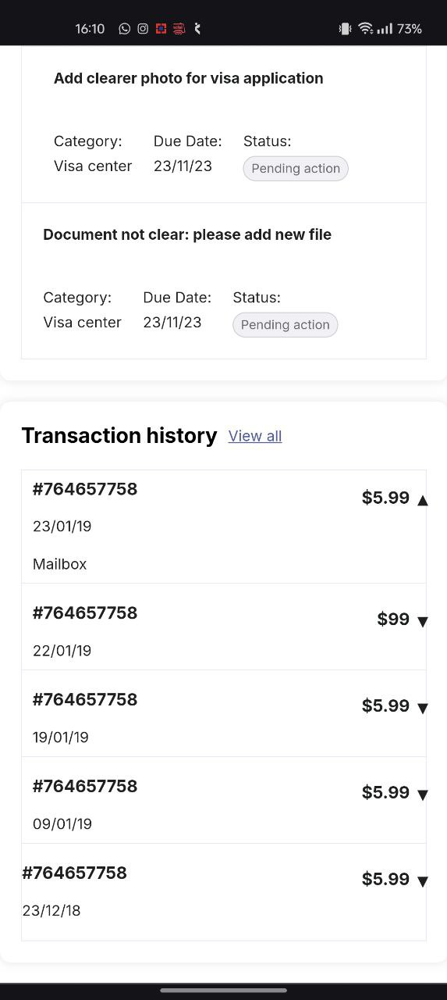

# Project Dashboard

## Web URL
https://sreyas-sc.github.io/e-dashboard/

## Overview

This project is a simple dashboard built using HTML, CSS, and JavaScript. It includes a table section and interactive buttons designed to showcase basic web design and functionality.

## Features

- **Table Section:** Displays data in a structured format.
- **Interactive Buttons:** Provides user interactions.
- **Responsive Design:** Adjusts to different screen sizes.

## Screenshots

Below are screenshots of the dashboard to illustrate its design and functionality.

### Dashboard Desktop View

### Dashboard Mobile View

## Acknowledgements

- HTML, CSS, and JavaScript for the core technologies used.

